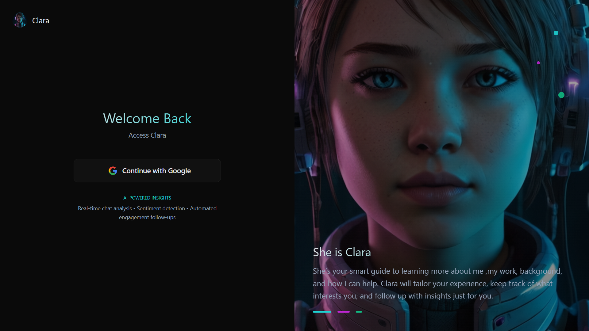
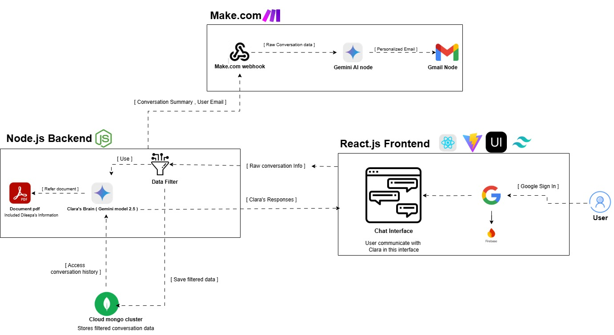

# Clara – AI-Powered Professional Engagement Assistant

  
*Your intelligent professional networking companion*

## 🌟 Overview

Clara is an AI-powered assistant designed to automate and personalize professional introductions. She engages visitors through natural conversations about Owner's(Dileepa) skills and projects, classifies their interest level, and triggers context-aware follow-ups.

**Key Value Proposition**:  
- ✅ 24/7 professional presence  
- ✅ Automated lead qualification  
- ✅ Personalized engagement tracking  

---

### System Architecture

  

## 🚀 Core Features

| Feature              | Description                                    | Tech Used         |
|----------------------|------------------------------------------------|-------------------|
| **Smart Q&A**        | Answers questions about skills/projects        | Gemini AI         |
| **Engagement Tracking** | Visual progress (Casual → Deep)             | Custom Algorithm  |
| **Auto Follow-ups**  | Personalized emails based on interaction       | Gmail API         |
| **Secure Auth**      | Google OAuth login                            | Firebase          |

---

## 🛠️ Setup Guide

### Prerequisites
- Node.js v18+
- MongoDB Atlas account
- Google Cloud API keys

### Installation
```bash
# Clone repo
gh repo clone DileepWick/clara-representative-agent

# Install dependencies
cd clara/backend && npm install
cd ../frontend && npm install

# Configure environment
cp .env.example .env
# Add your API keys
```

### Running Locally
```bash
# Start backend
cd backend && npm start

# Start frontend
cd frontend && npm run dev
```

---

## 📂 File Structure
```
clara/
├── backend/           # Node.js server
│   ├── routes/        # API endpoints
│   ├── services/      # Business logic
│   └── config.js      # Environment config
├── frontend/          # React app
│   ├── public/        # Static assets
│   └── src/
│       ├── components/ # UI components
│       └── pages/     # Page components
└── assets/            # Images and diagrams
```

---

## 📈 Engagement Workflow

### 1. Initial Contact
- Visitor asks about background
- Clara responds with tailored info
```json
{
  "engagement": "15%",
  "status": "Casual"
}
```

### 2. Deepening Interest
- Follow-up questions trigger detailed responses
```json
{
  "engagement": "65%",
  "status": "Active"
}
```

### 3. Automated Follow-up
- System sends personalized email
```json
{
  "action": "email_sent",
  "template": "technical_skills"
}
```

---

## 📜 License
MIT License - Free for personal and professional use

---
